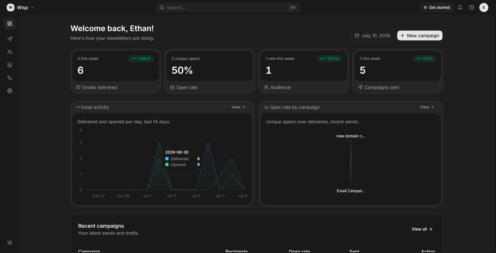

<div align="center">

# LetterStack

**Email campaign platform for organisations that send recurring newsletters.**
Block-based editor, email-safe HTML, delivery through Amazon SES from your own domain.

[Website](https://letterstack.site) · [Architecture](docs/architecture.md) · [Report a bug](https://github.com/krishpinto/Letterstack/issues/new) · [Request a feature](https://github.com/krishpinto/Letterstack/issues/new)

[](LICENSE)
[](https://github.com/krishpinto/Letterstack/actions/workflows/checks.yml)
[](https://nextjs.org)

</div>



## About

Most newsletter tools either lock your content into their editor or charge per
subscriber for delivery you could buy at cost. LetterStack does neither. You
design a campaign on a block canvas, it compiles to responsive table-based HTML
that survives Outlook and stays under Gmail's clipping threshold, and it sends
through your own Amazon SES account from your own verified domain.

Campaigns are stored as JSON, exported as HTML, and sent from infrastructure you
control. There is nothing to migrate off.

## Features

- **Block canvas editor** — 14 block types, live preview, undo/redo, autosave
- **Email-safe output** — tables and inline styles, no clipping at Gmail's 102KB limit
- **Send from your own domain** — SES domain identities with DKIM, or a shared subdomain
- **Gmail as a sender** — connect a mailbox via OAuth for small sends
- **Batched delivery** — QStash fan-out with idempotent workers, retry-safe
- **Deliverability built in** — automatic suppression on bounce and complaint
- **Analytics** — delivery, bounce, complaint, open and click via SES event notifications
- **Contact import** — CSV and XLSX with fuzzy header mapping, validation and dedupe
- **Signup forms** — embeddable inline, popup and slide-in forms
- **Automations** — triggered sequences on a flow canvas
- **Multi-workspace** — organisations, members, invites and per-plan limits

## Built with

- [Next.js](https://nextjs.org) — App Router, React 19, TypeScript
- [Neon](https://neon.tech) + [Drizzle ORM](https://orm.drizzle.team) — Postgres
- [Amazon SES](https://aws.amazon.com/ses/) — delivery and event notifications
- [Upstash QStash](https://upstash.com/docs/qstash) — queueing and scheduling
- [Tailwind CSS](https://tailwindcss.com) + [shadcn/ui](https://ui.shadcn.com) — interface
- [UploadThing](https://uploadthing.com) — image hosting
- [NextAuth](https://authjs.dev) — credentials and Google OAuth

## Architecture


A send goes: editor → `EmailDocument` (JSON) → compiler → frozen HTML snapshot →
QStash fan-out in batches of 50 → workers → one SES call per recipient. Delivery
events return through an SES configuration set to SNS, and from there to a
webhook that writes them to Postgres and suppresses bad addresses.

See [docs/architecture.md](docs/architecture.md) for why it works this way —
idempotency, snapshot freezing, quota reservation, suppression and DMARC
alignment.

## Getting started

### Prerequisites

- Node.js 22+
- A Postgres database ([Neon](https://neon.tech) or any Postgres)
- An AWS account with SES access and a verified sending domain
- An [Upstash QStash](https://upstash.com) token

### Installation

```bash
git clone https://github.com/krishpinto/Letterstack.git
cd Letterstack
npm install
cp .env.example .env.local
```

Fill in `.env.local`, then:

```bash
npm run qstash:dev   # local QStash, in a second terminal
npm run dev
```

The app runs at `http://localhost:3000`. The editor, dashboard and import flow
work against Postgres alone — sending requires SES credentials and a QStash
token, and will tell you what is missing rather than failing quietly.

### Scripts

| Command | Description |
| --- | --- |
| `npm run dev` | Start the development server |
| `npm run build` | Production build |
| `npm run typecheck` | `tsc --noEmit` |
| `npm run lint` | ESLint |
| `npm run db:push` | Push schema changes with Drizzle |
| `npm run db:studio` | Open Drizzle Studio |

## Deployment

LetterStack is deployed on [Vercel](https://vercel.com) with Neon and Upstash.
Any host that runs Next.js with Node serverless functions works. Point
`APP_URL` at your deployment so QStash can reach the worker routes, and add your
webhook endpoint as an HTTPS subscriber to the SNS topic behind your SES
configuration set.

## Contributing

Issues and pull requests are welcome. See [CONTRIBUTING.md](CONTRIBUTING.md).

## Security

Please do not open public issues for security problems. See
[SECURITY.md](SECURITY.md) for how to report them.

## License

[Apache 2.0](LICENSE). "LetterStack" and its logo are trademarks and are not
granted by the licence — see section 6 and [NOTICE](NOTICE).

If you would rather not run SES, DKIM and a queue yourself,
[letterstack.site](https://letterstack.site) is the hosted version.
