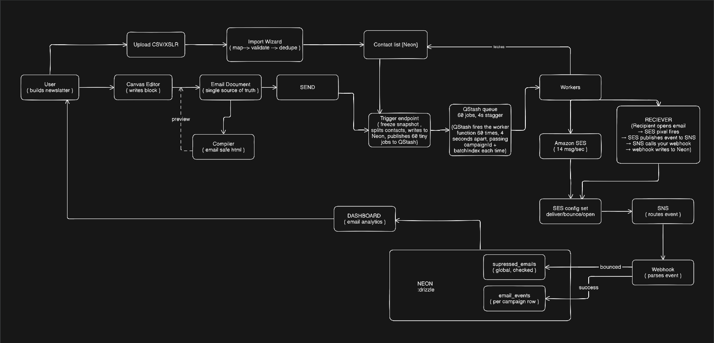

# Architecture

How a campaign gets from the editor to an inbox, and why each step is shaped
the way it is.



## The pipeline

1. **Editor → `EmailDocument`.** A JSON document is the single source of truth.
   The canvas writes to it; nothing else does.
2. **Compiler.** [`compileEmailDocument()`](../lib/email/compiler.ts) is the only
   thing in the codebase that produces HTML — for preview and for sending alike,
   so the two cannot drift.
3. **Freeze.** On send, the compiled HTML and its plain-text alternative are
   written to the campaign row and never read from live state again.
4. **Fan out.** The audience is chunked 50 per batch and published to QStash,
   each batch delayed 4s further than the last.
5. **Workers.** Each batch lands on a serverless worker that verifies the QStash
   signature, re-reads which recipients are still pending, and makes one SES call
   per address.
6. **Feedback.** An SES configuration set publishes delivery, bounce, complaint,
   open and click events to SNS, which posts them to
   [`/api/webhooks/ses`](../app/api/webhooks/ses/route.ts).

## Why the output is table-based HTML

Outlook on Windows renders email through Word's HTML engine, which has no
support for flexbox, grid, or CSS custom properties. Gmail clips messages over
roughly 102KB and hides the rest behind a "View entire message" link, which also
breaks open tracking for the clipped portion.

So the compiler emits tables with inline styles, and nothing else. It produces a
plain-text alternative in the same pass rather than as an afterthought, because a
missing text part is itself a spam signal.

## Why the snapshot is frozen at send time

A 3,000-recipient campaign takes around four minutes to go out. Without a frozen
copy, an edit made mid-send would mean recipient 1 and recipient 2,000 received
different emails, and there would be no record of what actually shipped.

`html_snapshot` is `NOT NULL` on every campaign. Workers read from it, never from
the live document.

## Why idempotency is mandatory

QStash retries on failure, so a worker can and will run twice with the same
payload. Before sending, each worker re-reads which of its recipients are still
pending and sends only to those, so a retry after a partial success re-sends to
nobody.

There is no exactly-once delivery here. There is at-least-once delivery plus an
idempotency check at the point of effect, which is the achievable thing.

## Why quota is reserved atomically

A guarded `UPDATE` reserves the full audience up front, all or nothing. Doing it
as a read-then-write would let two concurrent "Send now" clicks both pass the
check, and a partial reservation would cut a campaign off partway through its
list for no reason the sender could see.

## Why suppression is global

SES suspends an account above 10% bounce or 0.5% complaint, and those thresholds
are account-wide rather than per-sender. One customer's stale list would take
down delivery for everyone on the account.

Hard bounces and complaints are therefore written to a single suppression table,
checked by every campaign send and every list import, automatically.

## Why correlation rides on SES message tags

Each send is tagged with its campaign id. SES echoes the tag back inside the SNS
event payload, so a bounce arriving forty minutes later attributes itself without
needing a `MessageId → campaign` lookup table.

## Why one SES call per recipient

Not one message with thousands of BCCs. Each recipient gets their own one-click
unsubscribe token, a failure is attributable to a single address rather than
poisoning a whole batch, and bulk BCC is itself a spam signal.

## Why opens are presented as estimates

Apple Mail Privacy Protection pre-fetches every image, manufacturing an open for
every Apple Mail recipient whether or not a human looked. Gmail proxies and
caches images through its own servers.

Deliveries and bounces are facts; opens are estimates. The dashboard does not
present them as equally reliable.

## DMARC alignment

DMARC requires that the domain in the visible `From:` header match the domain
that passed SPF or DKIM. Sending from a branded subdomain initially failed this
and Gmail dropped the mail outright: the DKIM signature aligned to the parent
domain while `From:` said subdomain, and the subdomain had neither its own DKIM
key nor an SPF record.

Sends go from the parent domain until per-subdomain DKIM and SPF are configured.

## Rendering untrusted HTML

The admin campaign preview renders a customer's own HTML in an `iframe` with
`sandbox=""` — no `allow-scripts`. It only ever needs to display the markup,
never to execute it.

## Module boundaries

```
app/               pages and API routes
components/editor/ editor UI, split by concern
lib/email/         document.ts + compiler.ts — the shared core
lib/send/          batching, SES and Gmail transports, idempotency
lib/import/        parsing, header mapping, validation, dedupe
db/                Drizzle schema and migrations
```

These are treated as lint rules: `lib/*` never imports from `app/` or
`components/`, and `lib/email/` is the only module the editor and the send path
both depend on. That seam is what would make extracting either side cheap if it
ever became worth doing.
